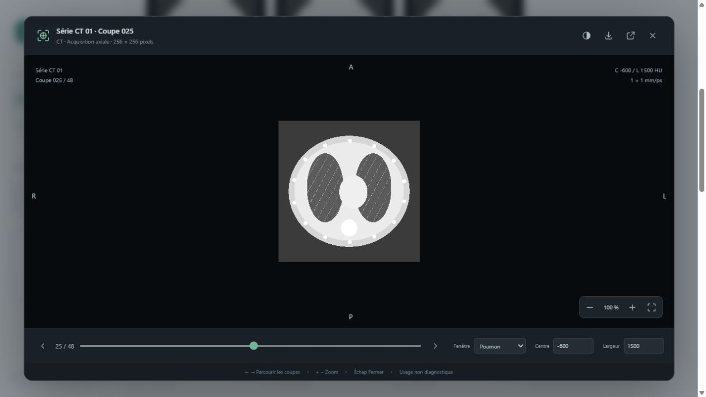

# Lumina — Guide utilisateur

Comprendre les images CT et explorer une série DICOM, étape par étape.

**Version du guide : 4 octobre 2026.** Ce guide accompagne la version actuelle de Lumina : images CT monochromes, avec une image par fichier DICOM. Il explique la navigation et les principes de lecture visuelle. L’interprétation clinique d’un examen relève d’un radiologue ; Lumina est une visionneuse de recherche sans validation diagnostique.

## 1. Première utilisation en cinq minutes

1. Ouvrez [Lumina](http://127.0.0.1:8765/) dans votre navigateur. Si la page ne répond pas, lancez `start.ps1` dans le dossier de l’application et laissez le terminal ouvert.
2. Sélectionnez une série dans **Mes séries**. Un exemple synthétique est chargé si vous avez exécuté `python tools/generate_demo.py`. Sinon, importez vos fichiers locaux.
3. Commencez par **Vue d’ensemble** pour parcourir jusqu’à 24 coupes réparties sur l’acquisition. Choisissez **Toutes les coupes** pour accéder à chaque image.
4. Cliquez sur une vignette : les détails de la coupe apparaissent dans **Image sélectionnée**, à droite sur grand écran.
5. Cliquez sur **Agrandir l’aperçu** pour examiner la coupe. Parcourez la série avec les flèches gauche/droite ou le curseur en bas de la visionneuse.

Pour changer d’acquisition, revenez à la bibliothèque et choisissez une autre série. Un numéro de coupe désigne sa place dans la série affichée ; il ne constitue pas à lui seul une référence anatomique entre deux examens.

## 2. Se repérer dans l’interface

| Zone ou commande | À quoi elle sert |
|---|---|
| **Mes séries** | Choisir une acquisition parmi les fichiers disponibles. |
| **Résumé de série** | Lire le nombre de coupes, la matrice de pixels et l’intervalle mesuré entre les coupes. |
| **Vue d’ensemble** | Voir un échantillonnage réparti sur la série. Les numéros sautent volontairement des coupes. |
| **Toutes les coupes** | Afficher une vignette pour chaque coupe. Les images se chargent progressivement au défilement. |
| **Rechercher une coupe** | Filtrer par numéro. Par exemple, « 25 » retrouve la coupe 025 ; une recherche partielle peut donner plusieurs résultats. |
| **Poumon / Tissus mous / Os** | Changer le contraste de tous les aperçus et de l’image sélectionnée. |
| **Aperçus** | Agrandir ou réduire toutes les cartes de la galerie. |
| **Image sélectionnée** | Voir la coupe, sa position, son plan et ses paramètres d’affichage. |
| **Cœur / Favoris** | Marquer des coupes puis retrouver les favoris de la série sélectionnée. |
| **Icône de fenêtre externe** | Ouvrir une visionneuse indépendante pour la coupe choisie. |

Les favoris et la taille des aperçus sont mémorisés dans ce navigateur. Un autre navigateur dispose de ses propres préférences. Les fichiers de la série ne sont pas modifiés par ces opérations.

## 3. Importer ses images

Cliquez sur **Importer des DICOM** ou **Ajouter une série**, puis sélectionnez plusieurs fichiers de l’acquisition. Vous pouvez également déposer les fichiers sur la page.

Lumina prend en charge les **CT monochromes à une image par fichier**. Les images multiframe, les IRM, les radiographies et les fichiers JPEG ordinaires ne font pas partie du périmètre de cette version. Un DICOM est un format qui rassemble les pixels et des informations d’acquisition ; il ne s’agit pas simplement d’une photographie.

La sélection est limitée à **2 000 fichiers et 250 Mo de fichiers par lot**. L’enveloppe de la requête d’import dispose d’une limite de 256 Mo. Si plusieurs acquisitions compatibles sont sélectionnées, Lumina les regroupe en séries selon leur identifiant et leur géométrie. Les fichiers incompatibles sont écartés et un message indique leur nombre.

Après l’import, la première série ajoutée est sélectionnée. Les fichiers acceptés restent sur cet ordinateur dans `data/imports/` et sont retrouvés au redémarrage. Les DICOM originaux peuvent contenir des informations personnelles, même si l’interface ne montre pas le nom du patient : **l’import ne réalise pas d’anonymisation**.

## 4. Comprendre ce qu’est une coupe CT

Le CT, aussi appelé scanner ou tomodensitométrie, utilise des rayons X et une reconstruction informatique pour produire des images en coupe de l’intérieur du corps. Une série contient des coupes situées à différents niveaux. Leur succession permet d’explorer un volume. [Présentation du scanner par RadiologyInfo](https://www.radiologyinfo.org/en/ctScan).

Imaginez un pain découpé en tranches : une coupe correspond à un niveau, et la série à l’ensemble des tranches. L’image CT représente cependant une épaisseur de reconstruction ; elle n’est pas une tranche matérielle infiniment fine.

| Plan | Image mentale |
|---|---|
| **Axial** | Coupe transversale, séparant conceptuellement le haut et le bas du corps. |
| **Coronal** | Coupe frontale, séparant l’avant et l’arrière. |
| **Sagittal** | Coupe de profil, séparant la droite et la gauche. |
| **Oblique** | Plan incliné par rapport à ces trois directions principales. |

La position et l’orientation enregistrées dans le DICOM définissent le plan de l’image dans le repère du patient. [Standard DICOM — géométrie de l’image](https://dicom.nema.org/medical/dicom/current/output/chtml/part03/sect_C.7.6.2.html).

Lumina affiche le **plan natif de l’acquisition**. Le libellé « axiale » décrit les images chargées ; ce n’est pas un bouton pour reconstruire automatiquement les plans coronal et sagittal.

## 5. Comprendre les niveaux de gris et les HU

Dans une image CT calibrée, l’intensité peut être exprimée en **unités Hounsfield**, ou **HU**. Cette échelle décrit l’atténuation des rayons X relativement à l’eau. L’eau correspond à 0 HU et l’air à environ −1000 HU. Les valeurs enregistrées doivent être transformées selon les paramètres de calibration du DICOM avant l’affichage. [Échelle HU — Medical Imaging Systems](https://www.ncbi.nlm.nih.gov/books/NBK546157/table/ch8.tab1/), [Standard DICOM — calibration CT](https://dicom.nema.org/medical/dicom/2026c/output/chtml/part03/sect_C.8.2.html).

| Matériau ou tissu | Repère HU approximatif | Aspect avec un fenêtrage approprié, sans inversion |
|---|---|---|
| Air | Environ −1000 | Très sombre. |
| Poumon aéré | Valeurs négatives ; mélange d’air et de tissus | Généralement sombre, avec des structures internes plus claires. |
| Graisse | Environ −100 à −60 | Plus sombre que beaucoup de tissus mous. |
| Eau | 0 | Sa luminosité dépend de la fenêtre choisie. |
| Muscle et autres tissus mous | Souvent quelques dizaines de HU | Plusieurs niveaux de gris. |
| Os | Plusieurs centaines à plusieurs milliers de HU | Généralement clair. |

Ces repères sont des ordres de grandeur pédagogiques, pas des seuils de diagnostic. Les valeurs et l’aspect dépendent notamment de l’acquisition, de la reconstruction et de la composition du voxel. Les plages ne permettent pas d’identifier à elles seules une structure ou une maladie. [Table de référence HU](https://www.ncbi.nlm.nih.gov/books/NBK546157/table/ch8.tab1/).

**Une zone blanche n’est pas, à elle seule, une anomalie.** L’os peut être blanc, et certains tissus deviennent blancs lorsqu’une fenêtre les sature. De même, une région noire peut correspondre à de l’air ou au fond de l’image. Le contraste et le contexte anatomique sont indispensables.

L’application ne propose pas de mesure HU au clic ou de région d’intérêt. Les valeurs **Centre** et **Largeur** sont des paramètres d’affichage, pas des mesures d’un organe.

## 6. Choisir une fenêtre de contraste

Une fenêtre sélectionne la plage d’intensités répartie entre le noir et le blanc. Les intensités plus basses ou plus hautes que cette plage sont saturées aux extrémités. Le réglage change l’affichage, sans changer les pixels DICOM originaux. [Standard DICOM — fenêtrage](https://dicom.nema.org/medical/dicom/current/output/chtml/part03/sect_C.11.2.html).

*Comparaison produite à partir de la coupe 025 du fantôme synthétique inclus sous forme de générateur. Cette illustration ne représente aucune personne et ne constitue pas une anatomie de référence. Les trois panneaux représentent les mêmes pixels avec des contrastes différents.*

| Fenêtre dans Lumina | Centre | Largeur | Ce qu’elle aide à distinguer |
|---|---:|---:|---|
| **Poumon** | −600 HU | 1500 HU | Les variations dans les régions pulmonaires aérées. Les tissus plus denses peuvent paraître uniformément blancs. |
| **Tissus mous** | 40 HU | 400 HU | Des différences plus fines autour des intensités des tissus mous. Les régions aérées deviennent très sombres. |
| **Os** | 400 HU | 1800 HU | Une plage étendue de valeurs élevées ; certains détails osseux sont moins saturés. |

Il s’agit des préréglages de cette application, pas de valeurs universelles pour tous les scanners.

Dans la visionneuse, **Centre** déplace la plage étudiée. **Largeur** contrôle son étendue : une petite largeur accentue les différences dans une plage étroite ; une grande largeur affiche une plage plus large avec moins de contraste local.

Pour se représenter le réglage « Tissus mous », centre 40 et largeur 400 correspondent approximativement à une plage de −160 à +240 HU. La convention DICOM LINEAR utilisée comporte un ajustement d’un demi-HU aux limites ; cette approximation sert à comprendre le réglage. [Définition DICOM de la fenêtre](https://dicom.nema.org/medical/dicom/current/output/chtml/part03/sect_C.11.2.html).

**Exercice :** ouvrez une coupe thoracique, gardez le même numéro, puis passez de Poumon à Tissus mous et à Os. Observez les zones qui deviennent saturées. Revenez à Poumon pour retrouver le contraste initial. Le bouton d’inversion échange les niveaux clairs et sombres ; il ne change pas l’anatomie.

Le **contraste d’affichage** doit être distingué du **produit de contraste** éventuellement administré pendant l’examen. Ce produit peut modifier l’apparence de certaines structures dans les données acquises ; changer de fenêtre ne peut pas simuler une injection. [RadiologyInfo — produits de contraste](https://www.radiologyinfo.org/en/info/safety-contrast).

## 7. Reconnaître les grands repères thoraciques

Sur une coupe du thorax, les deux régions pulmonaires se situent de part et d’autre d’une région centrale, le médiastin, où se trouvent notamment le cœur et de gros vaisseaux. Les côtes bordent la cage thoracique ; les vertèbres se trouvent en arrière. Les vaisseaux et les parois des voies aériennes peuvent former des lignes ou des points plus clairs dans les régions pulmonaires, selon leur direction par rapport au plan de coupe. Un scanner thoracique montre les poumons, les structures centrales et les os du thorax. [RadiologyInfo — scanner thoracique](https://www.radiologyinfo.org/en/info/chestct).

Ces repères constituent une introduction générale. La capture montre un fantôme synthétique pour illustrer la navigation ; elle ne représente pas un examen réel. Une structure doit être suivie sur plusieurs coupes avant de comprendre sa forme et sa continuité.

| Lettre affichée | Direction du patient |
|---|---|
| **R** | Right : droite. |
| **L** | Left : gauche. |
| **A** | Anterior : avant. |
| **P** | Posterior : arrière. |
| **S** | Superior : vers la tête. |
| **I** | Inferior : vers les pieds. |

Sur le schéma de démonstration, **R** apparaît à gauche de l’écran : ce bord correspond à la droite du patient. Repérez-vous avec les lettres issues du DICOM plutôt qu’en assimilant systématiquement la gauche de l’écran à la gauche du patient. Sur un plan oblique, plusieurs lettres peuvent se combiner. Si la géométrie manque, Lumina ne certifie pas l’orientation et affiche un avertissement. [Repère patient DICOM](https://dicom.nema.org/medical/dicom/current/output/chtml/part03/sect_C.7.6.2.html).

## 8. Comprendre la résolution et les distances

Un **pixel** est un élément de l’image affichée. Un **voxel** est un élément du volume : il possède une étendue dans trois dimensions. Agrandir l’image rend ses pixels plus visibles ; cela n’ajoute pas de détails à l’acquisition.

| Information affichée | Signification dans Lumina |
|---|---|
| **Résolution : 256 × 256 px** | Nombre de colonnes et de lignes de l’image. Ce n’est pas une dimension en millimètres. |
| **Pixel : 1 × 1 mm** | Espacement des centres de pixels dans le plan, dans l’ordre ligne puis colonne. |
| **Intervalle : 2 mm** | Espacement médian mesuré entre les positions de coupe, lorsque la géométrie permet de le calculer. |
| **Position : 48 mm**, par exemple | Projection de la position de la coupe sur la normale du plan d’acquisition. Ce n’est ni une taille d’organe ni nécessairement la coordonnée Z du patient. |

L’intervalle entre les coupes et leur **épaisseur de reconstruction** sont deux notions distinctes. Lumina affiche l’intervalle mesuré, et non une mesure indépendante de l’épaisseur. Les distances enregistrées sont définies par les attributs de géométrie DICOM. [Standard DICOM — espacement et épaisseur](https://dicom.nema.org/medical/dicom/current/output/chtml/part03/sect_C.7.6.2.html).

Sur la démonstration synthétique, 256 pixels espacés de 1 mm correspondent à un champ de l’ordre de 256 mm. C’est une estimation de grille, pas une mesure anatomique. Lumina n’offre pas de règle de mesure dans cette version.

## 9. Utiliser les deux zooms et la nouvelle fenêtre

| Réglage | Effet | Ce qui est conservé |
|---|---|---|
| **Zoom Aperçus, de 70 % à 160 %** | Redimensionne toutes les cartes de la galerie et adapte le nombre de colonnes. | Numéros de coupe, contraste et pixels originaux. |
| **Zoom dans la visionneuse, de 50 % à 400 %** | Agrandit l’image par rapport à son ajustement initial à la fenêtre. Après agrandissement, glisser l’image permet de la déplacer. | Intensités DICOM et coupe choisie. |
| **Fenêtre de contraste** | Change la correspondance entre intensités et niveaux de gris. | Géométrie et données originales. |

Dans la visionneuse, **100 %** correspond à l’ajustement de référence de l’image dans la fenêtre disponible. Ce n’est pas nécessairement un pixel écran pour un pixel DICOM. Le bouton d’ajustement revient à 100 % et recentre l’image.

Pour détacher l’image, cliquez sur **Nouvelle fenêtre** dans les détails ou sur l’icône correspondante dans la visionneuse. Les réglages de contraste et d’inversion courants sont transmis ; la nouvelle visionneuse commence avec son propre zoom d’ajustement. Ensuite, les deux vues sont indépendantes : changer une coupe ou son contraste dans une fenêtre ne synchronise pas l’autre.

Le navigateur peut ouvrir un onglet plutôt qu’une fenêtre ou bloquer une popup. Le navigateur intégré de Codex n’a pas ouvert les popups lors de la vérification. Pour cette fonction, ouvrez Lumina dans Chrome ou Edge et autorisez les fenêtres contextuelles pour l’adresse locale si nécessaire.

## 10. Raccourcis, favoris et export

| Action | Commande |
|---|---|
| Sélectionner une coupe | Clic sur la vignette. |
| Agrandir l’aperçu | Double-clic sur une vignette, bouton dédié ou **Espace** quand la page ou une vignette a le focus. |
| Coupe précédente / suivante | Boutons de parcours ou **← / →** dans la visionneuse. |
| Zoomer dans la visionneuse | **+ / −** ou boutons dédiés. |
| Choisir une coupe dans la série | Curseur de parcours en bas de la visionneuse. |
| Recentrer et ajuster | Bouton d’ajustement à côté du pourcentage de zoom. |
| Fermer l’aperçu | **Échap** ou bouton de fermeture. |
| Marquer / retirer un favori | Cœur sur la vignette ou dans les détails. |
| Exporter | Icône de téléchargement dans la visionneuse. |

Quand le curseur est dans un champ de saisie, les touches servent à ce champ. Les favoris sont filtrés pour la série sélectionnée : si une autre série semble vide, revenez à celle où vous avez marqué les images.

L’export produit un **PNG de la coupe entière**, avec le fenêtrage et l’inversion affichés. Le zoom et le déplacement de consultation ne recadrent pas le fichier. Les textes de la visionneuse ne sont pas incorporés au PNG. Ce fichier est une représentation en niveaux de gris ; il ne conserve pas les valeurs HU ni les métadonnées du DICOM. Pour une analyse quantitative, conservez les fichiers DICOM originaux.

## 11. Messages et difficultés fréquentes

| Situation | Explication et action |
|---|---|
| **La page ne s’ouvre pas** | Démarrez l’application avec `start.ps1` et ouvrez l’adresse indiquée par le serveur. Si le port a été changé, utilisez cette nouvelle adresse. |
| **Bibliothèque vide** | Aucun dossier de démonstration disponible ou aucune série importée. Ajoutez des DICOM CT compatibles. |
| **Aucune coupe trouvée** | Effacez la recherche ou vérifiez le numéro. |
| **Aucun favori** | Choisissez la bonne série ou marquez une coupe avec le cœur. |
| **Image illisible** | Le fichier peut être incomplet ou utiliser une compression dont le décodeur n’est pas installé. Essayez un DICOM connu comme lisible et consultez la personne qui gère l’environnement Python. |
| **Import trop volumineux** | Réduisez le lot à 250 Mo et 2 000 fichiers maximum. Pour une acquisition plus volumineuse, utilisez le lancement avec `-DataDir` vers son dossier complet ; cela évite de fragmenter une série entre plusieurs lots. |
| **Géométrie incomplète** | Le tri utilise un repli sur le numéro d’instance. Les repères et distances ne sont pas certifiés ; vérifiez les données d’origine. |
| **Positions dupliquées / espacement irrégulier** | Des coupes partagent un niveau ou les intervalles varient. Vérifiez l’acquisition avant d’utiliser les distances. |
| **Calibration HU absente** | Le lien entre intensité et HU n’est pas confirmé sur toutes les coupes. Ne traitez pas les préréglages comme une preuve de calibration. |
| **Nouvelle fenêtre sans effet** | Essayez Chrome ou Edge et vérifiez le blocage des popups du site local. |

Lumina n’effectue pas de reconstruction multiplanaire, de segmentation, de rendu 3D, de diagnostic automatique ou de connexion PACS. Les masques du notebook ne sont pas superposés dans cette version. La présence d’un effet de contraste ne signifie pas qu’un calcul de segmentation a été exécuté.

## 12. Parcours d’apprentissage conseillé

1. Sélectionnez la série de démonstration et regardez sa vue d’ensemble pour comprendre la succession des niveaux.
2. Ouvrez une coupe où les régions pulmonaires sont visibles. Lisez les repères R, L, A et P.
3. Parcourez quelques coupes adjacentes pour observer la continuité des structures.
4. Sur une seule coupe, comparez Poumon, Tissus mous et Os. Notez quelles zones gagnent ou perdent des détails visibles.
5. Augmentez le zoom, déplacez l’image, puis rétablissez l’ajustement.
6. Marquez une coupe en favori, retrouvez-la et exportez un PNG si vous avez besoin d’une illustration.

Au terme de ce parcours, vous saurez naviguer dans une acquisition et expliquer les réglages d’affichage. Une conclusion sur la présence ou l’absence d’une maladie nécessite l’examen complet, son contexte clinique et une interprétation médicale.

## Sources et provenance

Les explications anatomiques et physiques sont appuyées par les liens placés dans les sections correspondantes : RadiologyInfo, le standard DICOM et le manuel universitaire *Medical Imaging Systems*. Sources consultées le 4 octobre 2026.

Les captures montrent Lumina avec un fantôme informatique entièrement synthétique, produit par `tools/generate_demo.py`. La comparaison utilise ce même fantôme. Aucun DICOM réel, aucune coupe du notebook et aucune image de patient ne sont distribués. Les formes schématiques servent à expliquer le logiciel ; elles ne sont pas une anatomie de référence.

Les procédures et les limites de ce guide ont été vérifiées dans le code de la version actuelle. Pour l’installation, consulter le fichier `README.md` ; pour l’étude du pipeline Python, consulter `ANALYSE_NOTEBOOK.md`.
