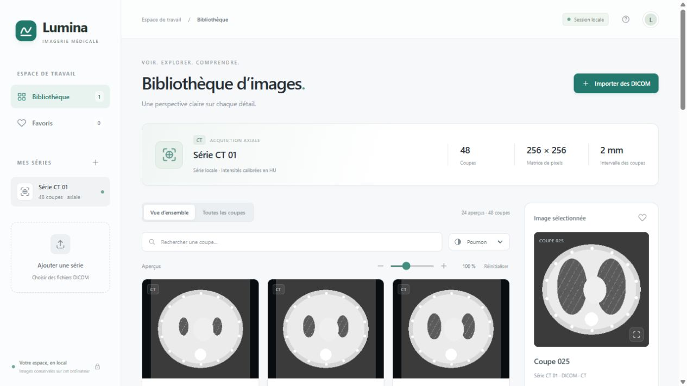
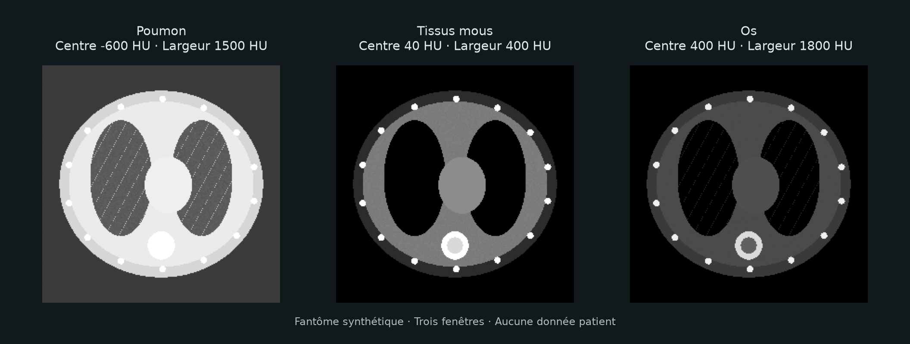

# Lumina — Local DICOM CT viewer

Lumina est une application web locale pour explorer des coupes CT : galerie, zoom commun des aperçus, visionneuse indépendante, contraste, favoris et export PNG. Son interface sobre est inspirée des applications Apple. La documentation utilisateur est en français.



## Démarrage

Python 3.10 ou ultérieur est requis. Aucun build JavaScript ni service cloud n’est nécessaire.

```bash
python -m venv .venv
```

Sous Windows :

```powershell
.\.venv\Scripts\python.exe -m pip install -r requirements.txt
.\.venv\Scripts\python.exe server.py
```

Sous macOS ou Linux :

```bash
.venv/bin/python -m pip install -r requirements.txt
.venv/bin/python server.py
```

Ouvrir [http://127.0.0.1:8765](http://127.0.0.1:8765). Une bibliothèque vide permet d’importer ses fichiers DICOM. Le serveur écoute uniquement sur l’interface locale.

## Démonstration synthétique

Pour découvrir le logiciel sans données médicales, générer un fantôme numérique avec l’interpréteur de l’environnement :

```bash
python tools/generate_demo.py
python server.py
```

Si l’environnement n’est pas activé, remplacer `python` par son chemin comme dans les commandes de démarrage. Le générateur écrit 48 coupes fictives dans `data/demo/`, dossier exclu de Git. Aucune image du notebook ni aucun examen réel ne sont inclus dans ce dépôt. Les formes du fantôme ne constituent pas une anatomie de référence.

## Utilisation

- **Vue d’ensemble** : jusqu’à 24 coupes réparties sur la série. **Toutes les coupes** : galerie exhaustive, chargement à la demande.
- **Aperçus** : zoom commun de 70 % à 160 % ; les cartes et le nombre de colonnes s’adaptent.
- **Visionneuse** : double-clic ou bouton d’aperçu ; parcours des coupes, zoom, déplacement, inversion et fenêtre personnalisée.
- **Contraste** : préréglages poumon, tissus mous et os ; application commune aux vignettes.
- **Nouvelle fenêtre** : visionneuse indépendante, selon les règles de popups du navigateur. Dans le navigateur intégré de Codex, cette action peut être ignorée ; utiliser Chrome ou Edge pour cette fonction.
- **Favoris et recherche** : cœur par coupe, filtre pour la série courante, recherche par numéro.
- **Import** : jusqu’à 2 000 fichiers et 250 Mo par sélection ; pour une série plus volumineuse, utiliser `--data-dir`.
- **Export** : PNG de l’image entière avec son contraste et son inversion ; les valeurs HU et les métadonnées DICOM ne sont pas conservées dans le PNG.

Charger une acquisition locale sans l’importer :

```bash
python server.py --data-dir "/chemin/vers/serie-CT" --port 8765
```

Sous Windows, `start.ps1 -DataDir 'D:\mes-images\serie-CT'` utilise l’environnement virtuel local lorsqu’il existe.

## Documentation

- [Guide utilisateur illustré](GUIDE_UTILISATEUR.md) : images CT, HU, contraste, orientation, distances, zooms, raccourcis et dépannage.
- [Analyse critique du notebook](ANALYSE_NOTEBOOK.md) : étude du pipeline fourni en référence, sans distribuer ses données ni son notebook.
- [Vérifications et limites](VERIFICATION.md).
- Guide dans l’application : [http://127.0.0.1:8765/guide](http://127.0.0.1:8765/guide), également accessible depuis l’aide. Il est imprimable en PDF avec le navigateur.



## Périmètre

Cette version prend en charge les CT monochromes à une image par fichier. Elle groupe les acquisitions compatibles, trie les positions sur la normale du plan, applique la transformation de modalité, respecte le rapport physique des pixels et signale les incohérences de géométrie. Certains DICOM compressés nécessitent un décodeur pydicom adapté.

Visionneuse de recherche sans validation diagnostique. Les mesures anatomiques, les reconstructions multiplanaires, la segmentation, le rendu 3D, les DICOM multiframe et la connexion PACS ne sont pas implémentés.

Les fichiers importés sont conservés dans `data/imports/`. Les préférences sont enregistrées dans le navigateur. Aucun service externe, CDN ni télémétrie ne reçoit les images. L’application n’effectue pas d’anonymisation ; les DICOM locaux restent inchangés.

## Code source

The source code is on the main branch, at the repository root and inside static/:

```bash
File	               Purpose
server.py	           Python server and DICOM processing
static/app.js	       Preview, global zoom and separate viewer window
static/index.html	   Web interface
static/style.css	   Visual design
```

## Tests

Avec l’interpréteur de l’environnement :

```bash
python -m unittest discover -s tests -v
node --check static/app.js
```

Les neuf tests utilisent des DICOM synthétiques : orientation, calibration fractionnaire et propre à chaque coupe, padding, fenêtrage, aspect, groupement, stabilité et routes HTTP.

Pour régénérer la documentation HTML et ses images synthétiques :

```bash
python -m pip install -r requirements-guide.txt
python tools/build_user_guide.py
```

Les dépendances d’auteur ne sont pas requises pour lancer l’application avec le guide HTML fourni.
